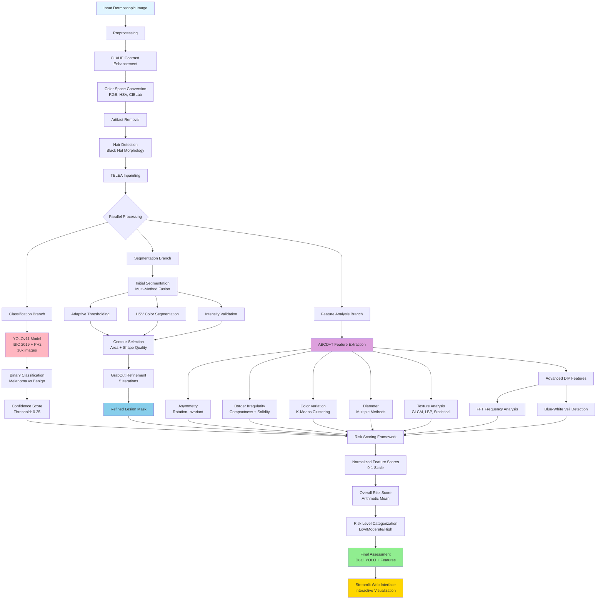
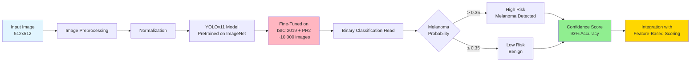
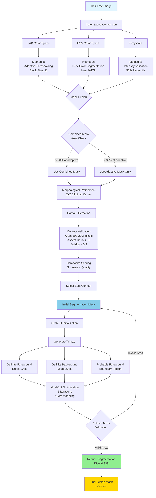
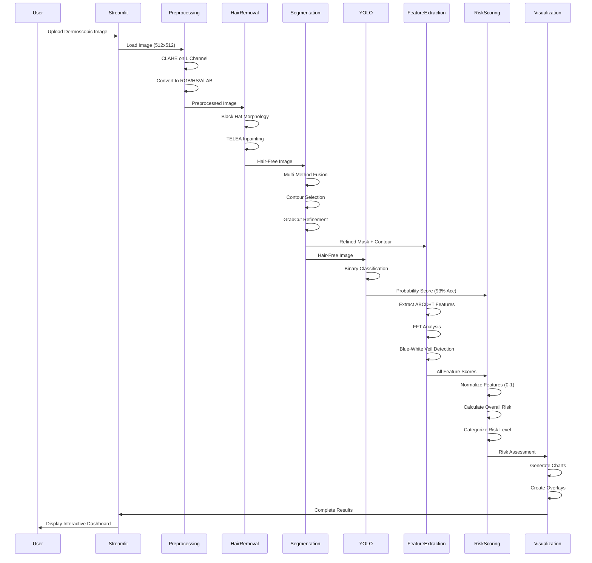
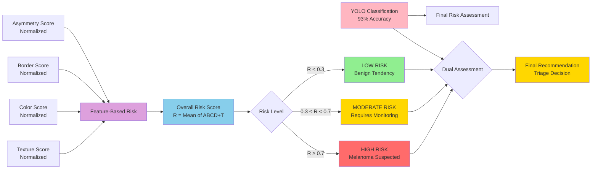
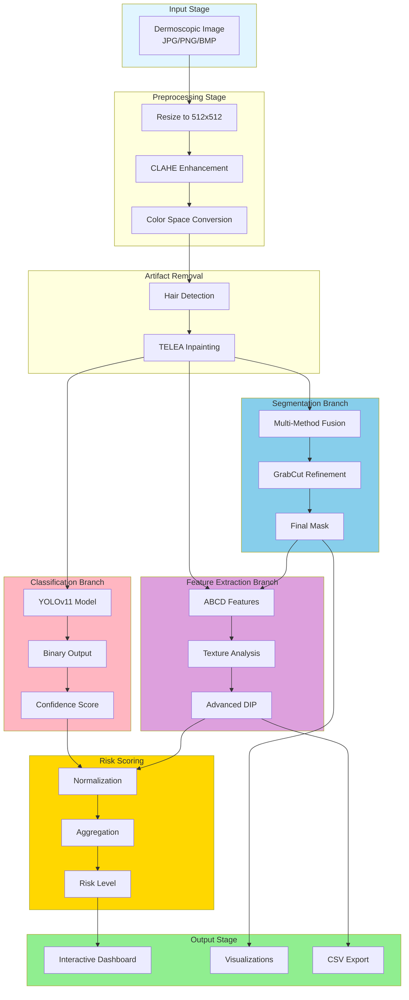

# Melanoma DIP Engine - System Flowcharts

This document contains Mermaid flowcharts visualizing the complete melanoma risk prediction system architecture and processing pipelines.

## 1. Overall System Architecture



## 2. Classification Pipeline (YOLOv11)



## 3. Segmentation Pipeline



## 4. Feature Analysis Pipeline (ABCD+T)

```mermaid
flowchart TD
    A[Segmented Lesion<br/>Mask + Contour] --> B[Feature Extraction Module]
    
    B --> C[Asymmetry Analysis]
    C --> C1[Calculate Image Moments]
    C1 --> C2[Rotate to Align Major Axis]
    C2 --> C3[Horizontal Flip Comparison]
    C2 --> C4[Vertical Flip Comparison]
    C3 --> C5[XOR Operation]
    C4 --> C5
    C5 --> C6[Asymmetry Score<br/>0.0 - 1.0]
    
    B --> D[Border Irregularity]
    D --> D1[Calculate Perimeter]
    D --> D2[Calculate Area]
    D1 --> D3[Compactness<br/>C = P²/4πA]
    D2 --> D3
    D --> D4[Convex Hull]
    D4 --> D5[Solidity<br/>S = A/A_hull]
    D3 --> D6[Combined Score<br/>B = 0.5C + 2.0(1-S)]
    D5 --> D6
    
    B --> E[Color Variation]
    E --> E1[Extract Lesion Pixels<br/>RGB Space]
    E1 --> E2[K-Means Clustering<br/>k = 2 to 6]
    E2 --> E3[Validate Cluster Sizes<br/>≥ 2% of pixels]
    E3 --> E4[Color Count<br/>1-6 scale]
    
    B --> F[Diameter Measurement]
    F --> F1[Equivalent Diameter<br/>D_eq = 2√(A/π)]
    F --> F2[Max Feret Diameter<br/>Convex Hull Points]
    F --> F3[Bounding Box Diagonal]
    F1 --> F4[Convert to mm<br/>10 pixels/mm]
    F2 --> F4
    F3 --> F4
    F4 --> F5[Largest Diameter<br/>Clinical Significance]
    
    B --> G[Texture Analysis]
    G --> G1[GLCM Features<br/>Distances: 1,2,3<br/>Angles: 0°,45°,90°,135°]
    G1 --> G2[Contrast, Homogeneity<br/>Energy, Correlation]
    G --> G3[LBP Analysis<br/>Radius: 1, Points: 8]
    G3 --> G4[Uniformity, Contrast<br/>Entropy]
    G --> G5[Statistical Features<br/>Mean, Std, Skewness]
    G --> G6[Gradient Features<br/>Sobel Operators]
    G6 --> G7[Gradient Magnitude<br/>Mean, Std]
    
    B --> H[Advanced DIP Features]
    H --> H1[FFT Frequency Analysis]
    H1 --> H2[2D FFT Transform]
    H2 --> H3[High-Pass Filter<br/>Radius: 10% of image]
    H3 --> H4[High-Frequency Energy<br/>High/Low Ratio]
    H --> H5[Blue-White Veil Detection]
    H5 --> H6[Blue-Green Dominance<br/>B+G > 1.2R]
    H5 --> H7[Blue Ratio<br/>B/R > 1.1]
    H5 --> H8[Localized Enhancement<br/>B > μ_B + 0.5σ_B]
    H5 --> H9[High Luminance<br/>L > 0.5]
    H6 --> H10[Veil Detection<br/>Coverage ≥ 1%]
    H7 --> H10
    H8 --> H10
    H9 --> H10
    
    C6 --> I[Feature Normalization]
    D6 --> I
    E4 --> I
    F5 --> I
    G2 --> I
    G4 --> I
    G7 --> I
    H4 --> I
    H10 --> I
    
    I --> J[Normalized Scores<br/>0-1 Scale]
    J --> K[Risk Score Calculation<br/>R = (A_n + B_n + C_n + T_n)/4]
    K --> L[Risk Level<br/>Low < 0.3<br/>Moderate 0.3-0.7<br/>High ≥ 0.7]
    
    style A fill:#e1f5ff
    style C6 fill:#FFB6C1
    style D6 fill:#87CEEB
    style E4 fill:#DDA0DD
    style F5 fill:#F0E68C
    style G2 fill:#98D8C8
    style H4 fill:#FFA07A
    style H10 fill:#FF69B4
    style L fill:#90EE90
```

## 5. Complete Processing Flow



## 6. Risk Scoring Framework



## 7. Data Flow Diagram



## Usage

These flowcharts can be:
1. **Rendered in Markdown viewers** (GitHub, GitLab, etc.)
2. **Exported to images** using Mermaid CLI or online tools
3. **Included in documentation** or presentations
4. **Referenced in the LaTeX report** (after conversion to images)

To convert to images:
```bash
# Install Mermaid CLI
npm install -g @mermaid-js/mermaid-cli

# Convert to PNG
mmdc -i flowcharts.md -o flowcharts.png

# Convert individual diagrams
mmdc -i flowcharts.md -o flowcharts.pdf
```

